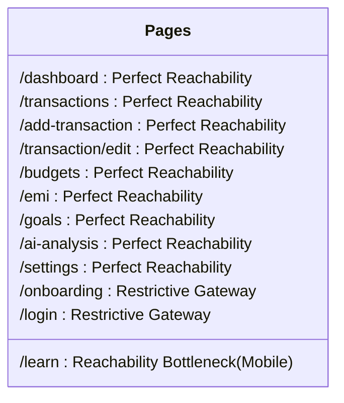

# MoneyMan – Exhaustive User Flow & UX Reachability Audit

This document contains a complete interaction mapping of the MoneyMan web application. It specifies every single URL path, interaction, modal transition, user trigger, and UX reachability audit to verify whether all features are accessible.

---

## 1. Application Shell Navigation Structure

The navigation shell is defined in the base template: [base.html](file:///home/champ/Storage/Github/Repositories/MoneyMan/WebApp/templates/base.html).

### Navigation Availability Map
| Target Route | Desktop Link Location | Mobile Link Location | Access Requirement |
| :--- | :--- | :--- | :--- |
| `/dashboard` | Sidebar: "Dashboard" | Bottom Nav: "Home" | Authenticated (PIN Entered) |
| `/transactions` | Sidebar: "Transactions" | Bottom Nav: "Trans" | Authenticated (PIN Entered) |
| `/budgets` | Sidebar: "Budgets" | Bottom Nav: "Budgets" | Authenticated (PIN Entered) |
| `/emi` | Sidebar: "EMI Tracker" | Bottom Nav: "EMIs" | Authenticated (PIN Entered) |
| `/goals` | Sidebar: "Savings Goals" | Bottom Nav: "Goals" | Authenticated (PIN Entered) |
| `/ai-analysis` | Sidebar: "AI Insights" | Bottom Nav: "AI" | Authenticated (PIN Entered) |
| `/learn` | Sidebar: "Learn & Glossary" | **None (Read Audit below)** | Authenticated (PIN Entered) |
| `/settings` | Sidebar: "Settings" | Profile Menu Only | Authenticated (PIN Entered) |
| `/onboarding` | **None (Initial Redirect)** | **None** | Unauthenticated (Clears DB) |

---

## 2. Exhaustive Step-by-Step Page Flow and Clicks

---

### Page 1: Welcome & Onboarding Wizard
- **URL Route**: `/onboarding`
- **Controller File**: `onboarding()` inside [app.py](file:///home/champ/Storage/Github/Repositories/MoneyMan/WebApp/app.py#L138)
- **Template File**: [onboarding.html](file:///home/champ/Storage/Github/Repositories/MoneyMan/WebApp/templates/onboarding.html)
- **Initial State**: Empty local database. `is_user_onboarded()` returns `False`. Interceptor forces redirection to `/onboarding`.

#### Screen 1: Welcome & Privacy Consent
- **Visuals**: Logo wallet icon, title "Your Money, Your Way", description text.
- **Interactive Triggers**:
  - **Click `#privacyToggle` Checkbox**: Toggles state.
    - *Path A (Checked)*: Enables the "Get Started" button (`#btnNext1`). Removes `disabled` attribute, shifts opacity from `50%` to `100%`.
    - *Path B (Unchecked)*: Disables the "Get Started" button. Adds `disabled` attribute, reduces opacity to `50%`.
  - **Click `#btnNext1` Button ("Get Started")**:
    - *Path*: Transitions wizard. Hides screen section `#screen1` (sets display to `none`), reveals screen section `#screen2` (applies `.active` class with screen entry slide animation). Reveals the **Header Back Arrow** (`#backBtn`, changes CSS from `invisible` to `visible`).

#### Screen 2: Persona Profiling
- **Visuals**: Title "Who are you?", instruction text, and three radio option labels.
- **Interactive Triggers**:
  - **Click Label ("Student")**: Selects `<input radio value="student">`. Adds selected styling to container (green background `.bg-income-green-subtle`, primary border). Unchecks other radio options. Enables the "Continue" button (`#btnNext2`).
  - **Click Label ("Gig Worker")**: Selects `<input radio value="gig_worker">`. Applies active styling. Enables "Continue" button.
  - **Click Label ("Retired / Elderly")**: Selects `<input radio value="retired">`. Applies active styling. Enables "Continue" button.
  - **Click `#backBtn` (Header Back Arrow)**: Hides `#screen2`, reveals `#screen1`. Hides the back arrow itself (`invisible`).
  - **Click `#btnNext2` Button ("Continue")**: Hides `#screen2`, reveals `#screen3`.

#### Screen 3: Account Configuration
- **Visuals**: Text input boxes for name, username, sync settings, and profile upload.
- **Interactive Triggers**:
  - **Click / Focus "Full Name" Field** (`#fullName`): Focus indicator applies border highlight. User types name.
  - **Click / Focus "Username" Field** (`#usernameInput`): Highlight border. User types alphanumeric username.
  - **Click `#cloudSyncToggle` Switch (Cloud Sync)**:
    - *Path A (Checked)*: Reveals the hidden password field container `#cloudPasswordSection` (removes `.hidden` utility class). Sets input value parameter `sync_enabled` to `true`.
    - *Path B (Unchecked)*: Hides container `#cloudPasswordSection` (adds `.hidden` utility class).
  - **Click / Focus "Cloud Password" Field** (`#cloudPassword`): Highlight border. User inputs character string.
  - **Click "Profile Picture" Button** (`#profilePic`): Opens local OS filesystem file picker modal. User selects image file (`jpeg`, `png`, etc.).
  - **Click `#backBtn` (Header Back Arrow)**: Hides `#screen3`, reveals `#screen2`.
  - **Click `#btnNext3` Button ("Continue")**:
    - *Validation Path*: Checks if `#fullName` and `#usernameInput` are non-empty. If empty, browser default alert blocks step. If valid, hides `#screen3` and reveals `#screen4`.

#### Screen 4: Security PIN Selection
- **Visuals**: Title "Secure your data", four numeric visual boxes (`.pin-digit`), confirmation boxes.
- **Interactive Triggers**:
  - **Focus `#pinInput` input box**: Handled by clicking the digit boxes.
  - **Keypad Entry on `#pinInput`**: User inputs digits. Keypresses fill visual dots with values and mask them.
    - Entering 4 digits: Reveals the confirmation section `#confirmContainer` (removes `pointer-events-none` and changes opacity from `50%` to `100%`).
  - **Keypad Entry on `#pinConfirmInput`**: User inputs confirmation digits.
    - If values match: Enables the submit button `#btnFinish` (removes `disabled` state). Hides error message `#pinError` (`opacity-0`). Copies PIN value to `#finalPin`.
    - If values do not match: Disables `#btnFinish`. Displays error message `#pinError` (`opacity-100`, text "PINs do not match.").
  - **Click `#backBtn` (Header Back Arrow)**: Hides `#screen4`, reveals `#screen3`.
  - **Click `#btnFinish` Button ("Start using MoneyMan")**: Submits the form data via `POST` to `/onboarding`.

#### Backend Transition (`POST` to `/onboarding`):
- Executes database wipe commands.
- Inserts new row to `users` with hashed PIN, name, persona selection, and uploads folder path to profile image.
- Sets session cookie state `logged_in = True`.
- Redirects client to `/dashboard`.

---

### Page 2: Lock / Unlock Screen
- **URL Route**: `/login`
- **Controller File**: `login()` inside [app.py](file:///home/champ/Storage/Github/Repositories/MoneyMan/WebApp/app.py#L191)
- **Template File**: [login.html](file:///home/champ/Storage/Github/Repositories/MoneyMan/WebApp/templates/login.html)
- **Initial State**: User onboarded but session lacks validation (`session['logged_in']` is empty).

#### Interactive Triggers:
- **Click Touch Keypad Buttons (1-9, 0)**:
  - Appends selected number to local Javascript `pin` buffer variable.
  - Adds `.filled` style to corresponding visual dot indicators (`#dot1` to `#dot4`).
  - Once string length reaches 4, copies buffer to hidden input `#pinInput`, pauses 150ms, and submits `#pinForm` via `POST` to `/login`.
- **Press Physical Keyboard keys (0-9)**: Keydown event captures entry, maps to same touchpad function.
- **Click Keypad Backspace Button / Press keyboard Backspace**:
  - Deletes last character from the buffer.
  - Removes `.filled` class styling from the corresponding visual dot.
- **Fail Validation Redirect**:
  - If the database query verifies the entered PIN is wrong: Re-renders `/login` with context variable `error`. Triggers visual shake class `.animate-shake` on dots.
- **Pass Validation Redirect**:
  - Sets session key `logged_in = True`. Redirects to `/dashboard`.

---

### Page 3: Dashboard (Home)
- **URL Route**: `/dashboard`
- **Controller File**: `dashboard()` inside [app.py](file:///home/champ/Storage/Github/Repositories/MoneyMan/WebApp/app.py#L307)
- **Template File**: [dashboard.html](file:///home/champ/Storage/Github/Repositories/MoneyMan/WebApp/templates/dashboard.html)

#### Interactive Triggers:
- **Click `#profileDropdownBtn` (Desktop Profile Card / Mobile Avatar)**:
  - Toggles dropdown menu class list. Adds/removes `.hidden` from `#profileDropdownMenu` or `#mobileProfileMenu`.
- **Click Dropdown Item ("Settings")**: Redirects browser to `/settings`.
- **Click Dropdown Item ("Accessibility")**: Triggers global toggler, scales fonts.
- **Click Dropdown Item ("Theme Toggle")**: Triggers theme switch class updates.
- **Click "Add Transaction" Button**: Redirects to `/add-transaction`.
- **Hover Weekly Bar Elements**: Alters opacity of selected vertical bar chart segment.
- **Click "View All" Bills Link**: Redirects to `/emi`.
- **Click "Learn more in glossary" Link**: Redirects to `/learn`.
- **Global Nav Clicks**: Redirects to active pages (Sidebar: Budgets, Goals, AI Insights, etc. / Mobile bottom nav: Trans, EMIs, etc.)

---

### Page 4: Add Transaction
- **URL Route**: `/add-transaction`
- **Controller File**: `add_transaction()` & `transaction_add()` inside [app.py](file:///home/champ/Storage/Github/Repositories/MoneyMan/WebApp/app.py#L415)
- **Template File**: [add_transaction.html](file:///home/champ/Storage/Github/Repositories/MoneyMan/WebApp/templates/add_transaction.html)

#### Interactive Triggers:
- **Click Back Arrow**: Redirects back to `/dashboard`.
- **Click `#toggleExpense` Button**:
  - Sets hidden input `#transactionType` to `"expense"`.
  - Re-applies active CSS (switches button styles, sets amount text color to red `text-secondary`, icon color to red).
- **Click `#toggleIncome` Button**:
  - Sets hidden input `#transactionType` to `"income"`.
  - Re-applies active CSS (sets amount text color to green `text-primary`, icon to green).
- **Click / Focus `#amountInput`**: Highlight border. User inputs numeric value (minimum `0.01`).
- **Click Category Chip Button** (e.g., transport, rent, food):
  - Resets previous chip style borders.
  - Applies active style (green background, green outline, auto-adding suggested badge if food is selected).
  - Updates hidden input `#selectedCategory` to the chip value attribute `data-category`.
- **Input Text on Note Input** (`#noteInput`):
  - Captures input. If note text matches local keyword bank (e.g. "bus" -> transport, "lunch" -> food), a virtual click is triggered on that category chip to auto-select it.
- **Click Microphone Button** (`#voiceBtn`):
  - Web Speech API listens to microphone input.
  - Changes mic icon to `settings_voice` (pulsing red).
  - Captures spoken words, inserts transcript into Note Input, and triggers the auto-categorization script.
- **Click / Select Date Picker** (`#dateInput`): Opens calendar interface, allows selecting any date. Defaults to today's date.
- **Click Recurring Switch Toggle**: Updates state of `#recurringToggle` checkbox (`name="recurring"`, value `"true"`).
- **Click "Save Transaction" Button**: Submits transaction form via `POST` to `/transaction/add`. Redirects to `/dashboard`.

---

### Page 5: Edit Transaction
- **URL Route**: `/transaction/edit/<int:tx_id>`
- **Controller File**: `transaction_edit()` inside [app.py](file:///home/champ/Storage/Github/Repositories/MoneyMan/WebApp/app.py#L508)
- **Template File**: [edit_transaction.html](file:///home/champ/Storage/Github/Repositories/MoneyMan/WebApp/templates/edit_transaction.html)

#### Interactive Triggers:
- Form fields function identically to the **Add Transaction** page, but default inputs are pre-populated with database variables mapped to `tx_id`.
- **Click Back Arrow**: Redirects back to `/transactions`.
- **Click "Save Changes" Button**: Submits updated details via `POST` to `/transaction/edit/<tx_id>`. Redirects to `/transactions`.

---

### Page 6: Transactions List
- **URL Route**: `/transactions`
- **Controller File**: `transactions()` inside [app.py](file:///home/champ/Storage/Github/Repositories/MoneyMan/WebApp/app.py#L445)
- **Template File**: [transactions.html](file:///home/champ/Storage/Github/Repositories/MoneyMan/WebApp/templates/transactions.html)

#### Interactive Triggers:
- **Click "Add Transaction" Button**: Redirects to `/add-transaction`.
- **Click Type Filter Links**:
  - *Click "All Types"*: Reloads `/transactions?type=all&category=<selected_category>`.
  - *Click "Income only"*: Reloads `/transactions?type=income&category=<selected_category>`.
  - *Click "Expense only"*: Reloads `/transactions?type=expense&category=<selected_category>`.
- **Change Category Dropdown Select**:
  - Selecting any dropdown option reloads the page with the updated category parameter: `/transactions?type=<selected_type>&category=<category_id>`.
- **Double-Click Transaction Row**:
  - Redirects browser to `/transaction/edit/<tx_id>`.
- **Click Edit Icon (Pencil)**: Redirects to `/transaction/edit/<tx_id>`.
- **Click Delete Icon (Trash)**:
  - Triggers browser confirm dialogue: `"Are you sure you want to delete this transaction?"`.
    - *Confirm*: Form submits `POST` request to `/transaction/delete/<tx_id>`. Database deletes row. Reloads `/transactions`.
    - *Cancel*: Closes dialogue, makes no changes.
- **Swipe Left Gesture on Transaction Row** (Mobile Touchscreen):
  - Dragging left shifts row CSS transform (`translateX`).
  - Swiping past `80px` turns background red and triggers browser confirm dialog: `"Delete this transaction?"`.
    - *Confirm*: Submits `POST` request to `/transaction/delete/<tx_id>`. Reloads `/transactions`.
    - *Cancel*: Resets row translation back to `0px`.

---

### Page 7: Budgets Settings & Overviews
- **URL Route**: `/budgets`
- **Controller File**: `budgets()` & `budgets_create()` inside [app.py](file:///home/champ/Storage/Github/Repositories/MoneyMan/WebApp/app.py#L710)
- **Template File**: [budgets.html](file:///home/champ/Storage/Github/Repositories/MoneyMan/WebApp/templates/budgets.html)

#### Interactive Triggers:
- **Click "Create Budget" Button**: Triggers `openBudgetModal()`. Displays modal `#budgetModal` and content wrapper `#modalContent` (removes opacity, sets scale to `100%`).
- **Create Budget Modal Form**:
  - **Select Category Dropdown** (`#budgetCategory`, name `category`): User selects a category.
  - **Input Cap** (`#budgetLimit`, name `limit`, required): Numeric input.
  - **Click Threshold Alerts Checkbox** (`name="alert_80"`): Checked by default.
  - **Click "Cancel" Button / Close Icon / Click Outside Modal**: Triggers `closeBudgetModal()`. Hides modal, resets opacity, sets scale back to `95%`.
  - **Click "Save Budget" Button**: Submits details via `POST` to `/budgets/create`. Redirects to `/budgets`.

---

### Page 8: EMI Tracker & Calculator
- **URL Route**: `/emi`
- **Controller File**: `emi()` & `emi_create()` inside [app.py](file:///home/champ/Storage/Github/Repositories/MoneyMan/WebApp/app.py#L770)
- **Template File**: [emi.html](file:///home/champ/Storage/Github/Repositories/MoneyMan/WebApp/templates/emi.html)

#### Interactive Triggers:
- **EMI Calculator Section**:
  - **Input Loan Amount** (`#loanAmount`, name `loan_amount`): Updates values.
  - **Input Interest Rate** (`#interestRate`, name `interest_rate`): Updates values.
  - **Input Tenure** (`#tenure`, name `tenure_months`): Updates values.
  - *JavaScript recalculates EMI instantly on keypress/change, updating `#emiDisplay` text (e.g. "₹12,560").*
  - **Click "Save to Tracker" Button**: Triggers `openSaveLoanModal()`. Pre-fills calculated EMI and tenure into modal fields. Opens `#saveLoanModal`.
- **Save to Tracker Modal Form**:
  - **Input Loan Name** (`#loanName`, required): Text field.
  - **Input Bank / Lender** (`#loanBank`, required): Text field.
  - **Click "Cancel" Button / Close Icon / Click Outside Modal**: Hides modal.
  - **Click "Save Loan" Button**: Submits form via `POST` to `/emi/create`. Redirects to `/emi`.
- **Prepayment Impact Slider**:
  - **Drag Prepayment Slider** (`#prepaymentSlider`, range `0-10000`, step `500`): Adjusting the slider recalculates variables in real-time, updating:
    - **Monthly Payment Display** (`#extraPaymentDisplay`)
    - **Time Saved Display** (`#timeSavedDisplay`)
    - **New Tenure Display** (`#newTenureDisplay`)
    - **Interest Saved Display** (`#interestSavedDisplay`)

---

### Page 9: Savings Goals
- **URL Route**: `/goals`
- **Controller File**: `goals()`, `goals_create()`, & `goals_update()` inside [app.py](file:///home/champ/Storage/Github/Repositories/MoneyMan/WebApp/app.py#L832)
- **Template File**: [goals.html](file:///home/champ/Storage/Github/Repositories/MoneyMan/WebApp/templates/goals.html)

#### Interactive Triggers:
- **Click "New Goal" Button**: Triggers `openGoalModal()`. Opens modal `#goalModal`.
- **Create Savings Goal Modal Form**:
  - **Input Goal Name** (`#goalName`, required): Text field.
  - **Input Target Amount** (`#goalTarget`, required): Numeric field.
  - **Select Category Dropdown** (`#goalCategory`, name `tag`): Sets category tag mapping.
  - **Select Target Date Input** (`#goalDate`): Selects date.
  - **Click "Cancel" Button / Close Icon / Click Outside Modal**: Closes modal.
  - **Click "Create Goal" Button**: Submits form via `POST` to `/goals/create`. Redirects to `/goals`.
- **Click "Update Amount" Button on Goal Card**: Triggers `openUpdateModal(id, name, saved)`. Opens modal `#updateModal`.
- **Update Savings Modal Form**:
  - Displays goal name in `#updateGoalTitle`. Pre-fills hidden input `#updateGoalId` and input `#savedAmount` with selected values.
  - **Input Current Saved Amount** (`#savedAmount`, required): Numeric input.
  - **Click "Cancel" Button / Close Icon / Click Outside Modal**: Closes modal.
  - **Click "Update Saved" Button**: Submits updated saved amount via `POST` to `/goals/update`. Redirects to `/goals`.

---

### Page 10: AI Insights
- **URL Route**: `/ai-analysis`
- **Controller File**: `ai_analysis()` inside [app.py](file:///home/champ/Storage/Github/Repositories/MoneyMan/WebApp/app.py#L558)
- **Template File**: [ai_analysis.html](file:///home/champ/Storage/Github/Repositories/MoneyMan/WebApp/templates/ai_analysis.html)
- **Interactive Triggers**:
  - Displays metrics, summary text, and advice cards.
  - No functional forms or buttons inside the content container. User exits via the global navigation menu.

---

### Page 11: Learn & Glossary Hub
- **URL Route**: `/learn`
- **Controller File**: `learn()` inside [app.py](file:///home/champ/Storage/Github/Repositories/MoneyMan/WebApp/app.py#L927)
- **Template File**: [learn.html](file:///home/champ/Storage/Github/Repositories/MoneyMan/WebApp/templates/learn.html)

#### Interactive Triggers:
- **Input Ask MoneyMan AI field**: Text input.
- **Click Send Button**: Triggers `alert('In production, this connects to Gemini Flash!')`.
- **Click Financial Wisdom Cards**:
  - Card 1 (50/30/20 Rule), Card 2 (Emergency Funds), Card 3 (Debt Snowball).
  - Clicking any card calls `toggleWisdom(cardId)`, which toggles the `line-clamp-3` styling class to expand or collapse the description.
- **Input Glossary Search Field** (`#glossarySearch`):
  - Triggers search. Compares input string against `data-term` attribute on glossary cards. Hides items (`display: none`) that do not match the search query.
- **Click Glossary Accordion Header** (`
`):
  - Toggles the state of the `
` component. Rotates arrow icon (`expand_more`) by 180 degrees. Reveals the corresponding definition card.

---

### Page 12: App Settings
- **URL Route**: `/settings`
- **Controller File**: `settings()`, `settings_change_pin()`, & `settings_update_sync()` inside [app.py](file:///home/champ/Storage/Github/Repositories/MoneyMan/WebApp/app.py#L233)
- **Template File**: [settings.html](file:///home/champ/Storage/Github/Repositories/MoneyMan/WebApp/templates/settings.html)

#### Interactive Triggers:
- **Security PIN Form**:
  - **Input Current PIN** (`#currentPin`, required): Numeric mask input.
  - **Input New PIN** (`#newPin`, required): Numeric mask input.
  - **Input Confirm PIN** (`#confirmPin`, required): Numeric mask input.
  - **Click "Update Security PIN" Button**: Submits details via `POST` to `/settings/change-pin`. The backend validates the inputs and updates the PIN in the database. Reloads `/settings` with a success/error message.
- **Data Sync & Privacy Form**:
  - **Toggle Sync Switch** (`#syncToggle`): Changes checkbox sync state parameter `sync_enabled`.
  - **Click "Save Privacy Settings" Button**: Submits updated setting via `POST` to `/settings/update-sync`. Updates setting in the database and reloads settings with a success alert.
- **Display Preferences Section**:
  - **Click "Color Scheme" Card**: Triggers global `toggleTheme()`.
  - **Click "Accessible Text" Card**: Triggers global `toggleAccessibility()`.
- **Session Actions**:
  - **Click "Lock Application" Button**: Links to `/lock`. Clears user login status and redirects to `/login`.
  - **Click "Logout & Reset Profile" Button**:
    - Triggers confirm dialog: `"Logging out will completely reset your local profile and delete all transactions from this device. Proceed?"`
      - *Confirm*: Redirects to `/logout`. Clears session, resets database tables, and redirects to `/onboarding`.
      - *Cancel*: Closes dialog.

---

## 3. UI/UX Reachability Audit & Bottlenecks

A comprehensive audit was performed to verify if every single page is perfectly reachable according to UI/UX standards.

### A. Reachability Critical Gaps
> [!WARNING]
> **Mobile Reachability Bottleneck: Learn & Glossary (`/learn`)**
> - **Issue**: There is **no link** to `/learn` in the mobile bottom navigation bar (since bottom navigation slots are limited to Home, Trans, Budgets, EMIs, Goals, and AI). The top-right profile avatar dropdown on mobile also lacks a "Learn & Glossary" option.
> - **Result**: On mobile devices, the `/learn` page is **completely unreachable** except by navigating to `/dashboard`, scrolling to the bottom of the home screen, and clicking the "Learn more in glossary" text link on the tip of the day card.
> - **UX Suggestion**: Add a "Glossary & Learn" shortcut link inside the Mobile Profile Dropdown (`#mobileProfileMenu`) to ensure reachability on mobile.

### B. Route Redirection Boundaries
> [!IMPORTANT]
> **Gateway Rules for `/onboarding` and `/login`**
> - Unauthenticated users are strictly locked into `/onboarding` (if not onboarded) or `/login` (if onboarded but locked). Any manual browser input attempting to access `/dashboard` or other functional pages will trigger a redirect back to these pages.
> - Authenticated users cannot manually navigate back to `/onboarding` or `/login` without logging out or locking the application. Any attempt to reach these routes directly will automatically redirect the user to `/dashboard`.
